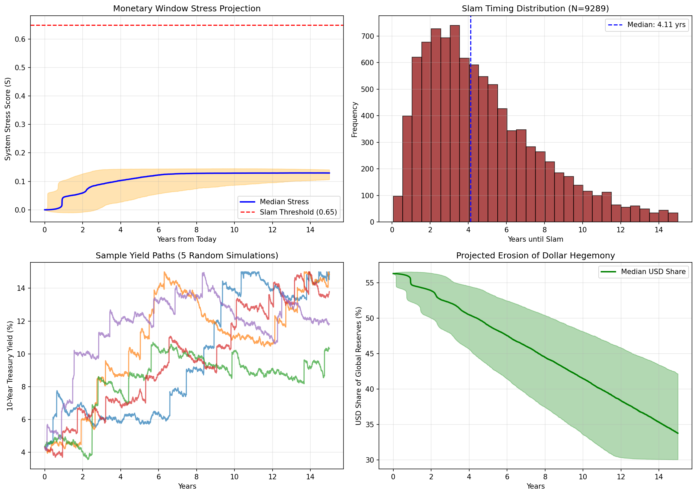

# Monetary Window Stress-Test Simulation

**A Monte Carlo simulation of systemic stress in the U.S. dollar monetary order.**

[](https://colab.research.google.com/github/siregarmr/monetary-window-stress-test/blob/main/Monetary_Window_Stress_Test.ipynb)

## Overview

This repository contains a quantitative stress‑test model that simulates the _"Closing Window"_ for a controlled transition to a new monetary framework (Bretton Woods 2.0 / P.C.M. or Public Cash Money). The model uses only publicly available data from FRED, the IMF (COFER), and CBO projections.

The simulation runs 10,000 possible future paths over a 15‑year horizon for six key macroeconomic variables and computes a _System Stress Score (S)_ . A _"Slam"_—the sudden, nonlinear closure of the transition window—is defined as the moment stress crosses a calibrated threshold. The output is a _probability distribution_ of slam timing, revealing where risk concentrates over time.

## Background

This work was born from @postaperdavide's public discussions on X regarding the long‑term stability of the U.S. dollar system, leading to his thought-provoking article (https://x.com/i/status/2045157814310453356). He proposed _Closing Window_ concept, along with monetary entropy, P.C.M. proposal, Bretton Woods 2.0 necessity. He also described the risk of sudden, catastrophic failure, which I formalized as the _"Slam"_, characterized as the nonlinear closure, and quantified using this Monte Carlo simulation as the probability distribution.

## Example Output (as of April 19, 2026)

Using live market data from April 2026, the simulation produced the following results:
```
=== SIM RESULTS (Effective Threshold = 0.12) ===
Probability of Slam within 5 years: 56.7%
-> Median time to Slam (within horizon): 2.76 years
Probability of Slam within 10 years: 86.1%
-> Median time to Slam (within horizon): 3.82 years
Probability of Slam within 15 years: 92.9%
-> Median time to Slam (within horizon): 4.11 years
```



Note: Results and plot vary with live data. Re‑run the notebook to see current probabilities.

## Methodology

### Variables Modeled

| Variable | Source | Dynamics |
| :--- | :--- | :--- |
| Debt‑to‑GDP Ratio | FRED / CBO | Drift + stochastic volatility |
| 10‑Year Treasury Yield | FRED | Mean‑reverting + shock spikes |
| VIX Volatility Index | CBOE | Mean‑reverting + fear spikes |
| USD Share of Global Reserves | IMF COFER | Negative drift + geopolitical shocks |
| Foreign Holdings of U.S. Debt | U.S. Treasury TIC | Negative drift |
| Geopolitical Risk Index | FRED / Oxford Economics | Mean‑reverting |

### Stress Function

A weighted, vectorized _System Stress Score (S)_ combines the normalized components:
```
S = 0.25 * DebtStress
  + 0.15 * YieldStress
  + 0.10 * VIXStress
  + 0.30 * TrustStress
  + 0.20 * GPRStress
```

### Slam Definition

A _"Slam"_ occurs when the normalized stress score exceeds `EFFECTIVE_THRESHOLD` (calibrated to 0.12 above current stress). The model includes frequent reflexive shocks (0.3% daily, ~53% annual probability) to capture systemic fragility.

## How to Run

### Option 1: Google Colab (Recommended)

Click the **"Open in Colab"** badge above or go to:
https://colab.research.google.com/github/siregarmr/monetary-window-stress-test/blob/main/Monetary_Window_Stress_Test.ipynb

Run all cells (`Runtime → Run all`). The simulation will fetch live data and execute in your browser.

### Option 2: Local Jupyter

```bash
git clone https://github.com/siregarmr/monetary-window-stress-test.git
cd monetary-window-stress-test
pip install pandas numpy matplotlib pandas-datareader yfinance
jupyter notebook Monetary_Window_Stress_Test.ipynb
```

## Repository Structure

```
monetary-window-stress-test/
├── Monetary_Window_Stress_Test.ipynb   # Main simulation notebook
└── README.md                           # This file
```

## Disclaimer

This is a simplified stress‑test model built for educational and discussion purposes only.
- It does not predict the future.
- It does not constitute financial, investment, or policy advice.
- Reflexivity is not modeled. The act of observing and publishing these results may alter market behavior.
